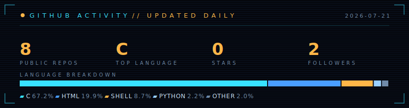

 

## About me

I'm César Vizcaíno, a programmer, IoT maker and IT technician based in Madrid. I enjoy taking
ideas all the way to working devices: writing C/C++ firmware for ESP32 and Arduino, designing
PCBs in KiCad, modelling and 3D-printing enclosures, and repairing electronics down to the
component level — from smartphones to vending machines.

- 🎓 Software Engineering student at **42 Madrid** (C · C++ · Bash)
- 🔌 End-to-end hardware projects: firmware, custom PCBs and 3D-printed enclosures
- 🧑‍🏫 IT trainer — workshops on cybersecurity, IoT and 3D printing
- 🛩️ Certified drone operator (STS)
- 🎻 Outside of tech: orchestra and theatre

 

## ⟡ Featured projects

| Project | Language | Description |
|:--|:-:|:--|
| [**Minishell**](https://github.com/EstudiosVizcaino/Minishell) | `C` | A small bash-like shell built from scratch: parsing, pipes, redirections and signal handling |
| [**philo**](https://github.com/EstudiosVizcaino/philo) | `C` | The dining philosophers problem — threads, mutexes and deadlock prevention |
| [**minitalk**](https://github.com/EstudiosVizcaino/minitalk) | `C` | Client/server data exchange implemented exclusively with UNIX signals |
| [**GNL**](https://github.com/EstudiosVizcaino/GNL) | `C` | get_next_line — reading any file descriptor one line at a time with a single static buffer |
| [**Printf**](https://github.com/EstudiosVizcaino/Printf) | `C` | A reimplementation of printf |
| [**Portfolio**](https://estudiosvizcaino.github.io/portfolio/) | `JS` | My interactive portfolio — WebGL, generative audio and a live GitHub feed |

> Hardware work — a smart building intercom, a BLE sheet-music page-turner pedal, a self-hosted DNS server — is showcased on [**my portfolio →**](https://estudiosvizcaino.github.io/portfolio/)

 

## ⟡ Tech stack

 

## ⟡ GitHub activity

 

`CÉSAR VIZCAÍNO` **·** `MADRID, SPAIN` **·** [`estudiosvizcaino.github.io/portfolio`](https://estudiosvizcaino.github.io/portfolio/)

